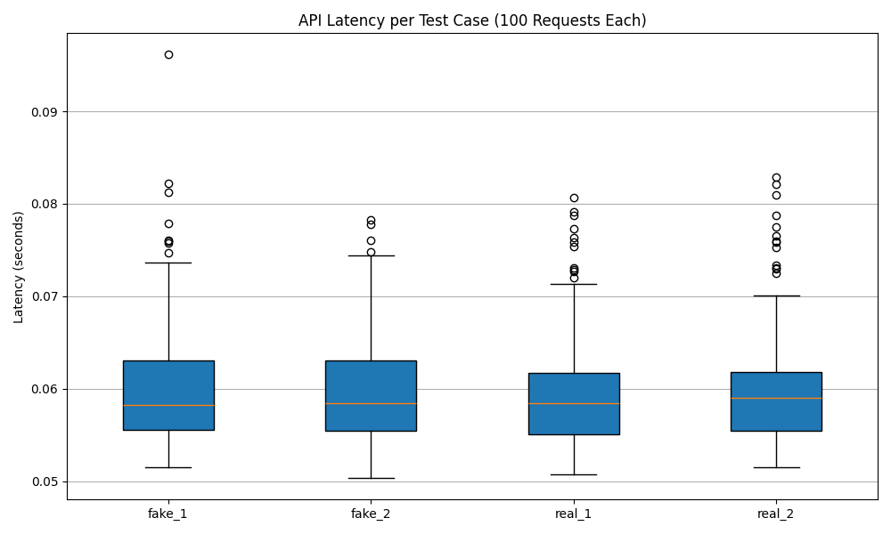

# ECE444-F2025-PRA5

# Text Classification Flask App

This repository contains a **Flask web application** for classifying text as **real news** or **fake news** using a pre-trained machine learning model. It also includes **functional and performance tests** with latency measurements.

# Latency / Performance Testing

100 requests per test case were sent to the deployed API.

Latency was recorded and saved as CSV in the results/ folder.

The average latency and boxplots were generated to visualize performance.

## Boxplot of API Latencies

## Average Latency per Test Case

fake_1: average latency = 0.0609 seconds
fake_2: average latency = 0.0600 seconds
real_1: average latency = 0.0601 seconds
real_2: average latency = 0.0606 seconds